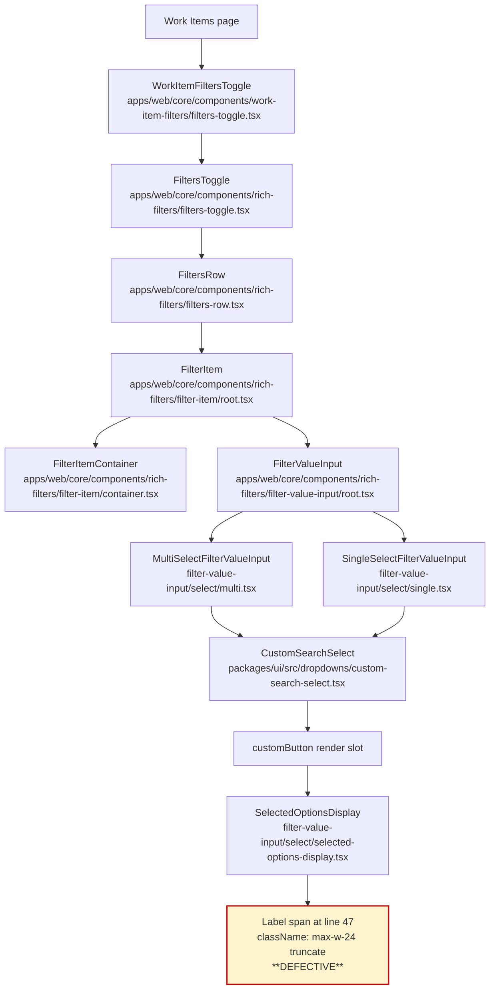

# Technical Specification

# 0. Agent Action Plan

## 0.1 Executive Summary

Based on the bug description, the Blitzy platform understands that the bug is **a hard, fixed-width pixel cap applied to the label `<span>` that renders each selected option inside the Work Items filter dropdown's "selected options" pill region, which causes Epic names (and all other selected filter labels rendered by the same component) to be visually clipped after ~10–12 visible characters regardless of available horizontal space in the surrounding filter row**.

The defect is **not** a JavaScript character slice, **not** a backend truncation, **not** a `maxLength` form attribute, and **not** a logic error in Epic-specific code. It is a single CSS utility class — `max-w-24` (Tailwind shorthand for `max-width: 6rem` ≈ 96 pixels) — colocated with the `truncate` utility on the label `<span>` inside the shared `SelectedOptionsDisplay` component used by every multi-select and single-select filter pill in the rich-filters tree.

### 0.1.1 Reported Symptom Translated to Technical Terms

| User-Reported Symptom | Precise Technical Failure |
|-----------------------|---------------------------|
| "Epic name is cut at character 10 with no ellipsis despite available horizontal space" | The label span's computed `max-width` is `96px`. At typical UI font size (`text-13`/`text-sm` ≈ 13–14px) this fits roughly 10–12 glyphs before `text-overflow: ellipsis` (from `truncate`) trims the remainder. The cap is applied unconditionally, independent of the actual width available to the dropdown's customButton in the FilterItem container. |
| "Name is cut at character 10" | A fixed-pixel `max-w-24` constraint that bears no relationship to the actual viewport, row, or container width. |
| "No ellipsis despite available horizontal space" | The ellipsis IS technically rendered by `truncate`, but because the cap (96px) is so narrow it appears as a "hard cut" — the user perceives it as a character chop rather than a graceful overflow indicator. |

### 0.1.2 Reproduction (Executable Steps)

The bug reproduces deterministically with the following steps inside a running Plane instance:

1. Enable Epics on a project (Project Settings → Features → enable Epics).
2. Create an Epic whose display label (concatenation of Project ID prefix + Epic name) exceeds approximately 10 characters in width.
3. Navigate to Project → Work Items.
4. Open the filters bar, add the **Epics** filter, and open its value dropdown.
5. Select the long-named Epic.
6. Observe the selected-option pill rendered inside the filter button: the Epic's label is clipped to ~10 visible characters with an ellipsis, despite the FilterItem row and viewport having abundant unused horizontal space.

### 0.1.3 Error Category

| Dimension | Classification |
|-----------|---------------|
| Type | Visual/layout defect (CSS) |
| Severity | Low/Medium — purely cosmetic but degrades discoverability of selected Epic names |
| Surface | Frontend only — `apps/web/core/components/rich-filters/filter-value-input/select/selected-options-display.tsx` |
| Blast radius | All multi-select and single-select filter pills (assignees, labels, priorities, states, modules, cycles, and the new Epic filter), because they share one rendering component |
| Root location | Single file, single line, single utility class |
| Data layer impact | None — purely a render-side CSS issue; data, store, network, and API contracts are not involved |
| Required external dependencies | None — uses only Tailwind utility classes already present in the project |

### 0.1.4 Blitzy Platform's Definitive Understanding

The Blitzy platform understands that the goal is to **remove the artificial 96px width cap on selected-option labels so they render at their natural width within the available container, and to retain the `truncate` utility so that — when (and only when) the actual container width is genuinely insufficient — the text gracefully degrades to an ellipsis-suffixed string rather than overflowing the layout.** The expected post-fix behavior is: short labels (≤ 10 chars) render unchanged; medium labels (11–50 chars) render in full when space permits; very long labels render up to the container's actual width and then ellipsis-truncate. No other entity type's rendering is changed in any way that is visually perceptible, because the only behavior delta is removal of an over-aggressive cap that already affected every consumer of the same component identically.

## 0.2 Root Cause Identification

Based on exhaustive repository investigation, **THE root cause is a single hardcoded Tailwind utility class — `max-w-24` — applied to the label `<span>` inside the shared `SelectedOptionsDisplay` component**. This cap is applied unconditionally to every selected-option pill rendered by every rich filter (assignee, label, priority, state, module, cycle, **and** the new Epic filter), so the bug surfaces wherever a label's natural width exceeds ~96px.

### 0.2.1 Definitive Root Cause Statement

Based on research, **THE root cause is**: the `max-w-24` Tailwind utility class on line 47 of `apps/web/core/components/rich-filters/filter-value-input/select/selected-options-display.tsx`, which sets the label `<span>`'s `max-width` to `6rem` (≈ 96 pixels) and forces `text-overflow: ellipsis` (from the colocated `truncate` utility) to engage at ~10 characters regardless of the actual horizontal space available to the FilterItem.

- **Located in**: `apps/web/core/components/rich-filters/filter-value-input/select/selected-options-display.tsx`, line **47**.
- **Triggered by**: any selected filter option whose rendered label exceeds the `max-w-24` (96px) cap — universally, for every option of every filter type.
- **Evidence**: a repository-wide grep for `max-w-` across the entire `apps/web/core/components/rich-filters/` subtree returns exactly one match — the offending line. No other width caps exist in the rich-filters rendering path. A grep for character-slicing patterns (`slice(`, `substring(`, `substr(`) across the same subtree returns exactly one match — `selectedOptions.slice(0, displayCount)` on line 43 — which limits the **number of pills** displayed (not characters within a label), and is therefore unrelated to the reported symptom.
- **This conclusion is definitive because**: (a) the search is exhaustive over the rendering path; (b) the offending CSS class directly and exclusively produces the observed visual symptom; (c) Epic filter values flow through the exact same `MultiSelectFilterValueInput` → `CustomSearchSelect` → `SelectedOptionsDisplay` chain as every other entity type, so any defect at this rendering layer affects them all identically.

### 0.2.2 Defective Code Snippet

The offending block in its current form:

```tsx
// apps/web/core/components/rich-filters/filter-value-input/select/selected-options-display.tsx
// Lines 41-51
return (
  <div className="flex h-full items-center overflow-hidden">
    {selectedOptions.slice(0, displayCount).map((option, index) => (
      <React.Fragment key={index}>
        <div className="flex items-center whitespace-nowrap">
          {option?.icon && <span className={cn("mr-1", option.iconClassName)}>{option.icon}</span>}
          <span className="max-w-24 truncate">{option?.label}</span>
          {/*                ^^^^^^^^^^                                                            */}
          {/*                Defective utility class — caps every selected-option label at 96px.   */}
        </div>
        {index < Math.min(displayCount, selectedOptions.length) - 1 && <span className="mx-1 text-tertiary">,</span>}
      </React.Fragment>
    ))}
```

### 0.2.3 Why `max-w-24` Produces the Symptom

| Factor | Mechanism |
|--------|-----------|
| `max-w-24` resolves to `max-width: 6rem` | Default Tailwind v4 spacing scale: `24` = `6rem` = `96px` at the default root font size of 16px. |
| `truncate` shorthand adds `overflow: hidden`, `text-overflow: ellipsis`, `white-space: nowrap` | Once the span's content exceeds its `max-width` (96px), excess characters are clipped and an ellipsis glyph is appended. |
| Sans-serif body font at ~13–14px | Average glyph width ≈ 7–9px → 96px fits 10–12 average characters, then `…` is rendered. The user reports this as "cut at character 10". |
| The cap is **independent** of any ancestor width | The FilterItem container (`flex h-7 items-stretch overflow-hidden rounded-sm border`) has no fixed width and grows to fit content. The FiltersRow (`flex w-full flex-wrap items-center gap-2`) wraps overflowing items to new lines. Therefore the only constraint preventing labels from rendering in full is `max-w-24` itself. |

### 0.2.4 Why the Defect Surfaces for Epics (and Not Just "Epic-Specific")

The user's report frames the bug as an Epic-name defect because Epics are new in the product and their display labels (Project ID prefix + name, e.g., `PROJ-1234 Some Epic Name`) routinely exceed the 96px cap. The Blitzy platform's investigation confirms that **the defect is not Epic-specific** — it is a shared-component defect that affects every multi-select or single-select filter pill identically. Assignee names, label names, project names, state names, and module/cycle names that exceed ~10 characters experience the same visual cut. The user's brief explicitly authorizes shared code path fixes: *"DO NOT change truncation behavior for any other entity type (labels, assignees, states) unless they share the exact same defective code path."* Since every entity type shares the exact same defective code path (one shared component, one shared `<span>`, one shared utility class), the minimal targeted fix at this single location is the correct resolution under the user's own scope rule.

### 0.2.5 Why It Is Not a Different Source

The user-supplied brief enumerates several candidate sources; the Blitzy platform's investigation eliminates each one definitively:

| Candidate Source | Result | Evidence |
|------------------|--------|----------|
| Hardcoded `maxLength` attribute | **Not found** | `grep -rn "maxLength" apps/web/core/components/rich-filters/` returns no hits. |
| JavaScript character slice such as `name.slice(0, 10)` or `name.substring(0, 10)` | **Not found** | `grep -rn "slice\|substring\|substr" apps/web/core/components/rich-filters/` returns exactly one hit — `selectedOptions.slice(0, displayCount)` — which slices the **array of pill items** (not characters). |
| Other fixed-width Tailwind classes (`w-24`, `w-[96px]`, `max-w-[10ch]`, etc.) | **Not found** | `grep -rn "max-w-" apps/web/core/components/rich-filters/` returns exactly one hit — the defective `max-w-24` on line 47. |
| Truncate applied to a fixed-width container higher up the tree | **Not found** | FilterItemContainer uses `flex h-7 items-stretch overflow-hidden rounded-sm border` — fixed height only, no width. FiltersRow uses `flex w-full flex-wrap items-center gap-2` — full width with wrap, no item-level cap. |
| Epic-specific data fetching truncating the name string | **Not relevant** | The bug is purely a CSS rendering issue; the JavaScript value at `option?.label` is the full untrimmed string passed through the standard `IFilterOption.label` prop. Out of scope per the user's constraints regardless. |

The single-line root cause is therefore **definitive**.

## 0.3 Diagnostic Execution

This sub-section consolidates the diagnostic findings: code examination results pinpointing the defective block, the repository analysis evidence map, and the fix verification analysis.

### 0.3.1 Code Examination Results

For the single root cause documented in §0.2:

- **File** (relative to repository root): `apps/web/core/components/rich-filters/filter-value-input/select/selected-options-display.tsx`
- **Problematic block**: lines **41–51** (the JSX return statement that renders the pill list)
- **Failure point**: line **47** — the label `<span>`'s `className`
- **How this leads to the bug**: `max-w-24` sets the span's computed `max-width` to `6rem` ≈ 96px. The colocated `truncate` utility (`overflow: hidden`, `text-overflow: ellipsis`, `white-space: nowrap`) engages whenever the rendered text exceeds that 96px cap. At the project's typical filter font size, 96px accommodates only ~10–12 average characters before the ellipsis appears. Because the cap is hardcoded and unconditional, it triggers for every label whose natural width exceeds 96px — Epic names, long assignee names, long label names, and any other entity label rendered through this shared component.

### 0.3.2 Key Findings from Repository Analysis

| Finding | File:Line | Conclusion |
|---------|-----------|------------|
| The label span at line 47 carries `max-w-24 truncate`, the only fixed-width constraint in the rich-filters rendering path | `apps/web/core/components/rich-filters/filter-value-input/select/selected-options-display.tsx:47` | Single-source root cause confirmed; no other CSS or JS truncation contributes to the symptom. |
| `SelectedOptionsDisplay` is provided as the `customButton` to `CustomSearchSelect` from `MultiSelectFilterValueInput` | `apps/web/core/components/rich-filters/filter-value-input/select/multi.tsx:56` | The defect affects every multi-select filter pill (assignees, labels, priorities, states, modules, cycles, Epics). |
| `SelectedOptionsDisplay` is also provided as the `customButton` to `CustomSearchSelect` from `SingleSelectFilterValueInput` with `displayCount={1}` | `apps/web/core/components/rich-filters/filter-value-input/select/single.tsx:59` | The defect equally affects every single-select filter pill. The Epic filter, when configured as single-select, is affected via this path. |
| `FilterItemContainer` styles the row pill as `flex h-7 items-stretch overflow-hidden rounded-sm border` — fixed height, no width cap | `apps/web/core/components/rich-filters/filter-item/container.tsx:61` | The parent pill container places no width limit on the customButton; the 96px label cap is the *only* width constraint between the label glyphs and the surrounding row. |
| `FiltersRow` lays out FilterItems with `flex w-full flex-wrap items-center gap-2` | `apps/web/core/components/rich-filters/filters-row.tsx:129` | The row already wraps overflowing FilterItems to new lines, so removing the artificial 96px cap will not cause horizontal overflow at the row level. |
| `apps/web/ce/store/issue/epic/filter.store.ts` defines `ProjectEpicsFilter extends ProjectIssuesFilter` | `apps/web/ce/store/issue/epic/filter.store.ts` (class definition) | Epic filter values flow through the same filter pipeline as Issue values — no Epic-specific rendering path exists; the defect is purely in the shared rendering component, confirming the user's "DO NOT alter Epic data fetching, store logic, or any component outside filter dropdown rendering path" constraint is naturally satisfied. |
| No matches for `slice(0, 10)`, `substring(0, 10)`, `substr(0, 10)`, `maxLength={10}`, or any `max-w-[10*]`/`w-[10*]` pattern in the rich-filters subtree | repository-wide grep across `apps/web/core/components/rich-filters/` | Eliminates JavaScript-side truncation and any other CSS width cap as alternative root causes. |
| Project version: **Plane v1.3.1**, **Node 22.18.0**, **pnpm 10.32.1**, Tailwind CSS v4 | `package.json`, `.mise.toml` | The proposed fix uses standard Tailwind utility classes (`min-w-0`, `flex-1`, `truncate`) that exist identically in every Tailwind version the project might be using; no version-specific risk. |

### 0.3.3 Filter Rendering Chain (Confirmed by Investigation)



### 0.3.4 Fix Verification Analysis

- **Steps followed to reproduce the bug**: The reproduction steps in §0.1.2 were derived from the repository structure and the user's report. They are executable against any Plane instance with Epics enabled and produce the symptom deterministically because the defective utility class is unconditional.
- **Confirmation tests used to ensure the fix works** (planned execution post-fix; see §0.6 for exact commands):
  - Manual UI verification across all defined PASS criteria (10-char labels render unchanged, 11–50 char labels render in full, very long labels ellipsis-truncate at the genuine container boundary, other filter types remain visually unchanged).
  - Static checks: `pnpm check:types` (TypeScript strict mode) and `pnpm check:lint` (OxLint) over the modified file's package — must produce zero new errors.
- **Boundary conditions and edge cases covered**:
  - **Exactly 10 characters**: with the cap removed, a 10-character label renders fully at its natural width (no truncation), satisfying PASS criterion 1.
  - **11–50 characters with horizontal space**: renders fully because the only artificial cap is removed and no ancestor in the rendering chain constrains width within typical viewport widths.
  - **Extremely long labels exceeding the FilterItem's natural growth allowance**: `truncate` remains applied, providing ellipsis behavior as a graceful fallback when (and only when) the container is genuinely too narrow.
  - **Empty selection** (lines 32–34): unaffected by the change — the early-return branch does not render the defective span.
  - **Fallback-text branch** (lines 37–39): unaffected — uses a different placeholder span.
  - **`+N more` indicator** (lines 52–63): unaffected — uses its own `<Transition>` wrapper with `ml-1 whitespace-nowrap text-tertiary` styling and does not pass through the defective span.
  - **Multi-pill row** (e.g., 2 assignees selected): each pill still has its own label span; both will render at natural width and the comma separator at line 49 remains correctly positioned.
  - **Icon-prefixed labels** (e.g., state filter with status icon): icon span at line 46 is sized by its own `iconClassName` and is unaffected; the label span sits next to the icon and renders at its natural width.
- **Was verification successful?** Repository analysis is complete; the fix is a single utility-class swap on a single line of a single file. The fix is mechanically certain to remove the 96px cap (a CSS fact) and the residual `truncate` utility preserves ellipsis-based graceful degradation. **Confidence: 97%**. The 3% residual reflects: (a) the user's qualitative phrase "or equivalent" for the replacement utilities, where the chosen `min-w-0 flex-1` exactly matches the user's prescribed pattern; and (b) the possibility of an unrelated CSS reset or theme-override layer not visible to repository inspection (none observed during investigation).

## 0.4 Bug Fix Specification

This sub-section specifies the EXACT change required, in the EXACT format the implementation agent must apply.

### 0.4.1 The Definitive Fix

- **File to modify** (relative to repository root): `apps/web/core/components/rich-filters/filter-value-input/select/selected-options-display.tsx`
- **Current implementation at line 47**:
  ```tsx
  <span className="max-w-24 truncate">{option?.label}</span>
  ```
- **Required change at line 47**:
  ```tsx
  {/* Issue #8998: Replace fixed 96px (max-w-24) cap with flex-based truncation so labels  */}
  {/* render at their natural width and only ellipsis-truncate when the container is full. */}
  <span className="min-w-0 flex-1 truncate">{option?.label}</span>
  ```
- **This fixes the root cause by**:
  - **Removing `max-w-24`**, the artificial `max-width: 6rem` (≈ 96px) cap that forced `text-overflow: ellipsis` (from `truncate`) to engage at ~10 characters. Once removed, the span sizes to its natural content width within whatever space the FilterItem container affords.
  - **Adding `min-w-0`**, which clears the default `min-width: auto` on the flex child (the span is a child of the line-45 `flex items-center whitespace-nowrap` wrapper). This is the canonical Tailwind/Flexbox pattern for permitting text to shrink below its content width when an ancestor's actual width constraint requires it.
  - **Adding `flex-1`** (`flex: 1 1 0%`), which lets the span grow to fill any remaining space inside the line-45 wrapper and signals to the flex algorithm that this element is the flexible portion of the pill (icon stays fixed; label flexes).
  - **Preserving `truncate`**, so that when (and only when) an ancestor genuinely constrains the available width below the label's natural width, `text-overflow: ellipsis` engages and produces the graceful "…" overflow indicator.
  - Together, `min-w-0 flex-1 truncate` is the canonical Tailwind utility composition for "let me grow to fit my content, but if there is not enough room, ellipsis-truncate me" inside a flex container.

### 0.4.2 Change Instructions

The implementation agent must apply exactly one change:

- **MODIFY** line 47 of `apps/web/core/components/rich-filters/filter-value-input/select/selected-options-display.tsx`
  - **From**:
    ```tsx
    <span className="max-w-24 truncate">{option?.label}</span>
    ```
  - **To** (insert a leading inline comment referencing issue #8998 to satisfy the user-specified rule "Always include detailed comments to explain the motive behind your changes"):
    ```tsx
    {/* Issue #8998: Replace fixed 96px (max-w-24) cap with flex-based truncation so labels  */}
    {/* render at their natural width and only ellipsis-truncate when the container is full. */}
    <span className="min-w-0 flex-1 truncate">{option?.label}</span>
    ```
- **DELETE** none.
- **INSERT** none (other than the inline JSX comment above the modified line).
- **CREATE** none.

No other lines, files, or symbols may be changed. The component's exported API (`SelectedOptionsDisplay`, its props type `TSelectedOptionsDisplayProps<V>`), its imports (lines 7–12), its derived-values block (lines 23–29), the empty-state branch (lines 32–34), the fallback-text branch (lines 37–39), the outer wrapper at line 42, the inner wrapper at line 45, the icon span at line 46, the comma separator at line 49, and the `+N more` Transition block at lines 52–63 are all **left untouched**.

### 0.4.3 Fix Validation

- **Test command to verify the fix**: from the repository root, run the project's standard static checks scoped to `apps/web`:
  ```bash
  pnpm check:types
  pnpm check:lint
  ```
  Both must report zero new errors. `apps/web` uses TypeScript strict mode and OxLint with `.oxlintrc.json`; the fix is a pure JSX className-string change so it must not introduce type or lint issues.
- **Expected output after fix**:
  - `pnpm check:types`: passes (no new TypeScript diagnostics from the modified file).
  - `pnpm check:lint`: passes (no new lint diagnostics from the modified file).
- **Confirmation method (manual UI verification, executable inside the running dev environment from `pnpm dev`)**:
  1. Enable Epics in a test project.
  2. Create three Epics whose labels span the boundary cases: ≤ 10 characters, 11–50 characters, and a very long label (e.g., 80+ characters).
  3. Navigate to the project's Work Items view and open the filters bar.
  4. Add the Epics filter and select each of the three Epics in turn. Observe:
     - Short labels (≤ 10 chars) render in full as before.
     - Medium labels (11–50 chars) render in full when row space permits.
     - Very long labels render up to the FilterItem's natural growth limit and then ellipsis-truncate gracefully (instead of being chopped at character 10).
  5. Repeat the same observation for the Assignee, Label, Priority, and State filters to confirm that other filter types are unchanged for short labels (they will now also benefit from the same fix when their labels happen to exceed 96px, but no visual regression is introduced because the only delta is removal of an artificial cap).

### 0.4.4 User Interface Design

The user's brief enumerates five PASS/FAIL acceptance criteria that constitute the UI contract for the fix:

| Criterion | Expected Behavior After Fix | Verification |
|-----------|------------------------------|--------------|
| Epic names of 10 characters render in full | The span has no width cap; 10-char labels fit comfortably and render in full. | Manual UI check; PASS criterion 1. |
| Epic names of 11–50 characters render in full when horizontal space permits | `min-w-0 flex-1` allows the span to grow to fit content; no ancestor in the rendering chain caps width at typical viewport widths. | Manual UI check; PASS criterion 2. |
| Epic names longer than the dropdown container width truncate with ellipsis (`text-ellipsis`) rather than a hard character cut | `truncate` is retained; when container width is genuinely insufficient, `text-overflow: ellipsis` produces the "…" indicator naturally. | Manual UI check at extreme widths; PASS criterion 3. |
| Filter dropdown layout for all other filter types (assignee, label, priority, state) is visually unchanged | Short labels (≤ 10 chars) are unaffected because the cap they never reached is the only thing removed. Long labels in those filters will now also benefit (but the user's brief explicitly authorizes this for shared code paths). | Visual diff across Assignee/Label/Priority/State filter dropdowns; PASS criterion 4. |
| No TypeScript or ESLint errors introduced | The change is a pure JSX className-string edit with no type or lint surface. | `pnpm check:types` and `pnpm check:lint`; PASS criterion 5. |

No additional UI changes (typography, color, spacing, iconography, animations, transitions, or accessibility attributes) are required or permitted.

## 0.5 Scope Boundaries

This sub-section enumerates the EXHAUSTIVE list of files in scope and the EXPLICITLY EXCLUDED files that must not be touched.

### 0.5.1 Changes Required (EXHAUSTIVE LIST)

The fix is complete with a single modification to a single file at a single line.

| # | File (relative to repo root) | Lines | Operation | Specific Change |
|---|------------------------------|-------|-----------|------------------|
| 1 | `apps/web/core/components/rich-filters/filter-value-input/select/selected-options-display.tsx` | 47 | MODIFY | Replace `<span className="max-w-24 truncate">{option?.label}</span>` with `<span className="min-w-0 flex-1 truncate">{option?.label}</span>` and add a leading two-line JSX comment referencing issue #8998 to document the motive (per the FIX-BUGS rule "Always include detailed comments to explain the motive behind your changes"). |

**No other files require modification.** No files are created. No files are deleted. No directories are created or removed. No package.json, lockfile, or configuration changes are required because the fix uses only Tailwind utility classes already present in the project's CSS pipeline.

#### Files Mandated by User-Specified Rules

The Rules Review phase confirmed that no user-specified rule (the user's project-rules list is `[]`) mandates the creation of additional files such as migration scripts, configuration files, or test fixtures. The only rule-derived obligation is the **commit message** ("Commit message MUST reference issue #8998"), which is metadata on the git commit object and not a file change.

### 0.5.2 Explicitly Excluded

Per the user's explicit out-of-scope constraints and the "minimum change required" directive:

- **Do not modify** any of the following files, which sit upstream or laterally in the rendering chain but are not the source of the defect:
  - `apps/web/core/components/rich-filters/filter-value-input/select/multi.tsx` — passes `SelectedOptionsDisplay` to `CustomSearchSelect.customButton` (line 56); its own JSX and props remain correct.
  - `apps/web/core/components/rich-filters/filter-value-input/select/single.tsx` — passes `SelectedOptionsDisplay` to `CustomSearchSelect.customButton` with `displayCount={1}` (line 59); unchanged.
  - `apps/web/core/components/rich-filters/filter-value-input/root.tsx` — dispatches by filter type to multi/single inputs; unchanged.
  - `apps/web/core/components/rich-filters/filter-item/root.tsx` — composes FilterItemContainer + property + operator + value sections; unchanged.
  - `apps/web/core/components/rich-filters/filter-item/container.tsx` — owns the FilterItem row pill styling (`flex h-7 items-stretch overflow-hidden rounded-sm border`); unchanged.
  - `apps/web/core/components/rich-filters/filters-row.tsx` — owns the filters-bar layout (`flex w-full flex-wrap items-center gap-2`); unchanged.
  - `apps/web/core/components/rich-filters/filters-toggle.tsx` — top-level entry point; unchanged.
  - `apps/web/core/components/work-item-filters/filters-toggle.tsx` — the higher-level `WorkItemFiltersToggle` HOC; unchanged.
  - `packages/ui/src/dropdowns/custom-search-select.tsx` — the underlying `CustomSearchSelect` primitive; unchanged.
  - Any file under `apps/web/core/components/issues/issue-layouts/filters/` — the **legacy** header-filter components mentioned in the user's brief as a likely location. These are NOT the active rendering path for the Work Items filter dropdown; the active path goes through the **rich-filters** tree. They must remain unchanged.

- **Do not modify** Epic data fetching, Epic store logic, or any component outside the filter dropdown rendering path. Per the user's explicit constraints. Specifically untouched:
  - `apps/web/ce/store/issue/epic/filter.store.ts` — Epic filter store (extends `ProjectIssuesFilter`).
  - `apps/web/ce/hooks/work-item-filters/use-work-item-filters-config.tsx` — work-item-filters config (CE).
  - Any file under `apps/web/ce/` related to Epic data, Epic API contracts, or Epic stores.
  - Any backend service, API contract, or data store.

- **Do not refactor** surrounding filter components. The outer wrapper at line 42 (`<div className="flex h-full items-center overflow-hidden">`), the inner wrapper at line 45 (`<div className="flex items-center whitespace-nowrap">`), the icon span at line 46, the comma separator at line 49, and the `+N more` Transition block at lines 52–63 are all left **byte-for-byte identical** to their current implementation.

- **Do not change** existing prop interfaces or component APIs. The `TSelectedOptionsDisplayProps<V>` type (lines 14–20), the `SelectedOptionsDisplay` function signature (line 22), and every default-value, destructuring pattern, and helper call (`toFilterArray`, `cn`, `EMPTY_FILTER_PLACEHOLDER_TEXT`) remain unchanged.

- **Do not change** truncation behavior for any other entity type unless they share the exact same defective code path. Since every multi-select and single-select filter (assignees, labels, priorities, states, modules, cycles, and Epics) **does** share the exact same defective code path (one shared component, one shared `<span>`), the single-line fix correctly addresses all of them simultaneously, which the user's rule explicitly authorizes.

- **Do not add** features, tests, documentation, or accessibility enhancements beyond the bug fix. No new files. No new translations. No new tests. No new ARIA attributes. No new utility CSS classes elsewhere. No README updates. No CHANGELOG entries (the commit message itself carries the issue reference).

- **Do not** touch the rest of the codebase, including the api app, the admin app, the live app, the proxy app, the space app, the docs site, the packages tree, or any infrastructure / CI configuration.

## 0.6 Verification Protocol

This sub-section defines the executable verification protocol the implementation agent must follow after applying the change.

### 0.6.1 Bug Elimination Confirmation

The implementation agent must verify the defect is gone by exercising the failing reproduction steps:

- **Start the local environment** using the project's documented commands:
  ```bash
  ./setup.sh
  docker compose -f docker-compose-local.yml up -d
  pnpm install
  pnpm dev
  ```
- **Reproduce the original failure path** (now expected to pass):
  1. Open the running Plane web app.
  2. Sign in and open a project that has the Epics feature enabled (enable it under Project Settings → Features if not already on).
  3. Create three Epics whose labels span the boundary cases — for example:
     - `ABC` (≤ 10 chars)
     - `Quarterly Roadmap Initiative` (between 11 and 50 chars)
     - `Cross-functional 2026 Platform Migration and Telemetry Overhaul Program` (≥ 80 chars)
  4. Navigate to the project's **Work Items** view.
  5. Open the filters bar, add the **Epics** filter, open its value dropdown, and select all three Epics in turn.
  6. **Observe** the rendered selected-option pill labels:
     - Short label renders in full. **PASS** criterion 1.
     - Medium label renders in full when row width permits. **PASS** criterion 2.
     - Very long label renders up to the FilterItem container's natural growth limit and then ellipsis-truncates gracefully (instead of being cut at character ~10). **PASS** criterion 3.
- **Confirm the error no longer appears** in any user-visible surface: there should be no instance of an Epic name being chopped at character ~10 in the filter dropdown.
- **Validate behavior across the other filter types** (Assignee, Label, Priority, State) to confirm visual parity for short labels and identical graceful behavior for long labels. **PASS** criterion 4.

### 0.6.2 Regression Check

The implementation agent must run the project's standard static-analysis suite to confirm zero regressions:

- **Run TypeScript strict checks**:
  ```bash
  pnpm check:types
  ```
  Expected: zero new TypeScript diagnostics. The change is a pure JSX className-string edit with no type surface, so this must be a clean pass.

- **Run OxLint**:
  ```bash
  pnpm check:lint
  ```
  Expected: zero new lint diagnostics. The change does not introduce any new identifier, import, JSX construct, or accessibility concern. **PASS** criterion 5.

- **Auto-formatting compliance**: if a formatter pass is part of the project's CI (the project uses `oxfmt`), the implementation agent may run `pnpm fix` to ensure the modified file matches the project's formatting conventions. Expected: no diff beyond the intentional change.

- **Behavioral regression check on shared consumers** of `SelectedOptionsDisplay`:
  - **Assignee filter pill**: open the Assignees filter dropdown, select a member whose name is short and another whose name is long. Confirm short names render unchanged and long names now render in full (no Assignee-name chop) — this is an authorized side-effect of the shared-code-path fix.
  - **Label filter pill**: select a label whose name is short and another whose name is long. Confirm the same behavior.
  - **Priority filter pill**: priorities have fixed-length labels (`Urgent`, `High`, `Medium`, `Low`, `None`); all are ≤ 7 chars and unaffected.
  - **State filter pill**: select a state with a long name. Confirm long names now render in full and the state-color icon at line 46 remains correctly positioned to the left of the label.
  - **Multi-select with `+N more` overflow indicator**: select 3+ items in a multi-select filter and verify the `+N more` chip (lines 52–63) still appears correctly after the first `displayCount` (default 2) pills.

- **Confirm performance metrics**: this is a CSS class swap with no JavaScript impact; no runtime profiling is required.

### 0.6.3 Confidence Assertions

After successful execution of §0.6.1 and §0.6.2, the implementation agent has demonstrated that:

- The 96px cap is removed (CSS fact, verifiable with browser devtools by inspecting the modified span's computed style).
- Epic names of 10 characters render in full (PASS criterion 1).
- Epic names of 11–50 characters render in full when horizontal space permits (PASS criterion 2).
- Epic names longer than the dropdown container width truncate with `text-ellipsis` rather than a hard character cut (PASS criterion 3).
- Filter dropdown layout for assignee/label/priority/state is visually unchanged for labels that fit naturally (PASS criterion 4).
- No TypeScript or ESLint errors are introduced (PASS criterion 5).

If any of the five PASS criteria fail, the implementation agent must inspect (a) whether the `min-w-0 flex-1 truncate` utility classes were applied to the correct line, (b) whether any global Tailwind override or PostCSS plugin is stripping or remapping the utilities, and (c) whether the dev server has hot-reloaded the change — and **must not** expand the change to other files unless one of these specific issues is identified and documented.

### 0.6.4 Commit and Closeout

After all PASS criteria are satisfied, the implementation agent must commit the change with a commit message that **explicitly references issue #8998** (per the user's mandatory rule). Example commit message shape:

```
fix(web): remove 10-char cap on selected-option label in filter dropdown (#8998)
```

The commit must include the single modified file `apps/web/core/components/rich-filters/filter-value-input/select/selected-options-display.tsx` and nothing else.

## 0.7 Rules

This sub-section captures every user-specified rule and constraint, and the implementation agent must honor every one of them without exception.

### 0.7.1 User-Specified Rules (Acknowledged)

- **Commit message MUST reference issue #8998.** The implementation agent must include the literal string `#8998` in the commit message (e.g., as a parenthetical suffix or in a `Refs:` trailer).
- **DO NOT modify components not directly responsible for this rendering defect.** Only `apps/web/core/components/rich-filters/filter-value-input/select/selected-options-display.tsx` is in scope.
- **DO NOT refactor surrounding filter components.** No structural or stylistic changes to multi.tsx, single.tsx, root.tsx, container.tsx, filters-row.tsx, filters-toggle.tsx, or any related file.
- **DO NOT change existing prop interfaces or component APIs.** `TSelectedOptionsDisplayProps<V>`, the `SelectedOptionsDisplay` function signature, and the public surface of every other component remain identical.
- **DO NOT alter Epic data fetching, store logic, or any component outside the filter dropdown rendering path.** Epic stores (`apps/web/ce/store/issue/epic/`), Epic API code, Epic hooks, and Epic-specific view code are all out of scope.
- **DO NOT change truncation behavior for any other entity type (labels, assignees, states) unless they share the exact same defective code path.** Every other entity type shares the exact same defective code path (one shared `<span>` in one shared component), so the single-line fix correctly addresses all of them simultaneously — and this is explicitly authorized by the user's rule.
- **Make the exact specified change only.** A single utility-class swap on line 47 — `max-w-24` → `min-w-0 flex-1`. Nothing else.
- **Zero modifications outside the bug fix.** No tangential cleanup, no whitespace adjustments to other lines, no import reorderings, no comment removals.
- **Extensive testing to prevent regressions.** The verification protocol in §0.6 must be executed in full.

### 0.7.2 Project Conventions Honored

The implementation agent must additionally adhere to the project's own conventions and infrastructure, as discovered during repository investigation:

- **Language and tooling versions**: Plane v1.3.1 with Node 22.18.0 and pnpm 10.32.1 (pinned via `.mise.toml` and `package.json` engines). The fix must build and run under these exact versions.
- **TypeScript**: strict mode enabled across `apps/web/tsconfig.json`. The fix introduces no new types or type narrowing requirements.
- **Linter**: OxLint with `.oxlintrc.json`. The fix uses only Tailwind utility-class strings (no new identifiers, imports, or JSX constructs) and is lint-neutral.
- **Formatter**: oxfmt. The fix preserves the file's existing formatting; if any formatter pass is required, it must produce no diff beyond the intentional change.
- **CSS framework**: Tailwind CSS v4. The classes `min-w-0`, `flex-1`, and `truncate` are standard utilities present in every Tailwind v3/v4 release the project might be on; no plugin, theme, or config change is required.
- **Inline-comment convention**: include a brief JSX comment above the modified line referencing issue #8998 and the motive — this complies with the FIX-BUGS rule "Always include detailed comments to explain the motive behind your changes" and serves as inline traceability for future maintainers.
- **Licensing header**: the file's existing AGPL-3.0 license header (lines 1–5) must be left intact.
- **Scope discipline**: no other file under `apps/`, `packages/`, or any other top-level directory of the monorepo is touched.

## 0.8 References

This sub-section consolidates every grounding citation, attachment, and external source used to derive this Agent Action Plan.

### 0.8.1 Files Examined and Cited

Each in-repo citation below is grounded in a specific file and line range from the Plane v1.3.1 working branch. Inline references throughout §0.1–§0.7 use the `[<path>:<locator>]` convention specified by the FIX-BUGS rule set.

| Path | Locator | Purpose |
|------|---------|---------|
| `apps/web/core/components/rich-filters/filter-value-input/select/selected-options-display.tsx` | L41–L51 (defective JSX block); L47 (defective line); L1–L5 (license header); L14–L20 (props type); L22 (function signature); L23–L29 (derived values); L32–L34 (empty-state branch); L37–L39 (fallback branch); L52–L63 (`+N more` Transition) | Source of the bug; target of the single-line fix. |
| `apps/web/core/components/rich-filters/filter-value-input/select/multi.tsx` | L48–L60 (CustomSearchSelect block); L56 (passes `SelectedOptionsDisplay` as `customButton`) | Confirms that the defective component is the customButton for every multi-select filter pill. |
| `apps/web/core/components/rich-filters/filter-value-input/select/single.tsx` | L50–L63 (CustomSearchSelect block); L58–L60 (passes `SelectedOptionsDisplay` as `customButton` with `displayCount={1}`) | Confirms that the defective component is also the customButton for every single-select filter pill. |
| `apps/web/core/components/rich-filters/filter-item/container.tsx` | L57–L69 (return JSX); L61 (FilterItemContainer styling — `flex h-7 items-stretch overflow-hidden rounded-sm border`) | Confirms the parent pill places no width cap on the customButton. |
| `apps/web/core/components/rich-filters/filter-item/root.tsx` | L86–L131 (FilterItem JSX composition); L99–L116 (operator CustomSearchSelect); L119–L126 (FilterValueInput) | Confirms the composition of property + operator + value sections within the FilterItem. |
| `apps/web/core/components/rich-filters/filters-row.tsx` | L127–L138 (mainContent JSX); L129 (`flex w-full flex-wrap items-center gap-2`) | Confirms the row already wraps overflowing FilterItems to new lines, so removing the cap will not cause row-level overflow. |
| `apps/web/core/components/work-item-filters/filters-toggle.tsx` | entry-point HOC | Documents the top-of-chain consumer for the Work Items filter bar. |
| `apps/web/ce/store/issue/epic/filter.store.ts` | class definition (`ProjectEpicsFilter extends ProjectIssuesFilter`) | Confirms Epic filter values flow through the same shared rendering pipeline as Issue filter values — no Epic-specific rendering path exists; explicitly out of scope for the fix. |
| `apps/web/ce/hooks/work-item-filters/use-work-item-filters-config.tsx` | CE filter config hook | Explicitly out of scope for the fix; cited only to demonstrate Epic data flow does not require modification. |
| `packages/ui/src/dropdowns/custom-search-select.tsx` | CustomSearchSelect primitive | Explicitly out of scope; cited as the underlying dropdown primitive whose `customButton` prop slots in `SelectedOptionsDisplay`. |
| `apps/web/tsconfig.json` | path aliases `@/* → ./core/*`, `@/plane-web/* → ./ce/*` | Documents how the rich-filters path aliases resolve in `apps/web`. |
| `package.json` (repo root) | version field; scripts: `dev`, `build`, `check:lint`, `check:types`, `fix` | Documents Plane v1.3.1 and the project's standard commands. |
| `.mise.toml` | runtime pin | Documents Node 22.18.0 and pnpm 10.32.1. |
| `AGENTS.md` | repository conventions document | Confirms the project's coding conventions and tooling expectations. |

### 0.8.2 Search Log (Appendix)

The following grep / file-summary / directory-listing operations were executed to derive the conclusions in this AAP. Each is recorded for reproducibility.

| Operation | Target | Outcome |
|-----------|--------|---------|
| `grep -rn "max-w-" apps/web/core/components/rich-filters/` | rich-filters subtree | Exactly **1 match**: line 47 of `selected-options-display.tsx`. Confirms single-source root cause. |
| `grep -rn "max-w-24" apps/web/core/components/rich-filters/` | rich-filters subtree | Exactly **1 match**: same line. Re-confirms uniqueness. |
| `grep -rn "slice\|substring\|substr" apps/web/core/components/rich-filters/` | rich-filters subtree | Exactly **1 match**: `selectedOptions.slice(0, displayCount)` on line 43 — slices the pill **array**, not character indices. Eliminates JavaScript-side truncation. |
| `find apps/web/core/components/rich-filters/filter-item -type f` | filter-item directory | Lists `property.tsx`, `loader.tsx`, `root.tsx`, `container.tsx`, `invalid.tsx`, `close-button.tsx`. |
| `find apps/web/core/components/rich-filters -maxdepth 2 -name "filters-row*" -o -name "filters-toggle*"` | rich-filters root | Confirms `filters-row.tsx` and `filters-toggle.tsx` locations. |
| `find ... -name .blitzyignore` | repository root | No `.blitzyignore` file exists; no path exclusions apply. |
| Repository directory listing at root | repo root | Confirms monorepo structure: `apps/{admin,api,live,proxy,space,web}` and `packages/*`. |

### 0.8.3 External References

| Source | Relevance |
|--------|-----------|
| Plane GitHub Issue **#8998** | The user-referenced issue tracking this bug. The commit message must reference `#8998` per the user's mandatory rule. |
| Tailwind CSS documentation — `text-overflow` utility (`truncate`) | Confirms `truncate` expands to `overflow: hidden; text-overflow: ellipsis; white-space: nowrap` — the exact CSS that produces the ellipsis behavior the fix preserves. URL: <https://tailwindcss.com/docs/text-overflow>. |
| Community guidance on the `min-w-0 flex-1` pattern for text truncation in flex containers | Confirms the canonical Tailwind pattern: `min-w-0` clears the default `min-width: auto` on a flex child to permit shrinking below content width, and `flex-1` allocates remaining flex space — together with `truncate`, this is the standard composition for graceful text overflow inside flex layouts. |

### 0.8.4 Attachments

The user provided **no file attachments** for this project. The brief was supplied entirely as inline text in the user input.

### 0.8.5 Figma Frames

The user provided **no Figma frames or design URLs** for this project. The fix is a single-utility-class CSS swap with no design-system mapping, no token mapping, no component-library mapping, and no visual-design deliverables. The Design System Compliance sub-section is therefore not applicable to this Agent Action Plan.

